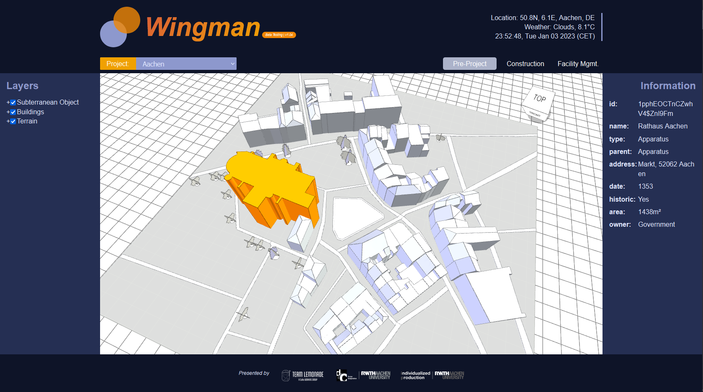

# Wingman

 

---

**[Wingman](https://wingman-bim.netlify.app)** is an open source life-cycle construction project infomation platform that runs in the browser. 

The platform is developed and maintained by [Team Lemonade](https://github.com/teamLemonade) and built with by [Xeokit](https://github.com/xeokit/xeokit-sdk).

The platform can be used for life-cycle construction project management. In combination of 3D model viewer, infomation panel and live data dashboard, it provides an effective way to look up the construction project infomation on the web, and is a good helper for project stakeholders.
